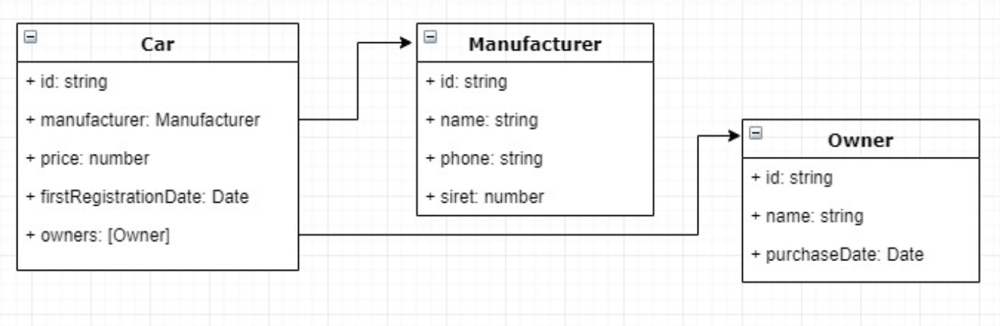

# Example of nest js application

### To run application clone this repository and exec next commands

* npm install
* npm start

##### You can also run application using Docker

### To execute end to end tests
* npm run test:e2e

### Description:

This is a little backend micro-service which aims to serve the cars data.
This component will expose a REST api providing CRUD operations to fetch one or several cars, create, update and
delete a car. Though this api, it will also be possible:

* Fetch only the manufacturer data for a given car (without any manufacturers dedicated APIs – i.e. only by
using the car API)

* To trigger a process which will automatically remove the owners who bought their cars before the last 18
months and apply a discount of 20% to all cars having a date of first registration between 12 and 18 months.

The car data model will be kept relatively simple (Figure 1).

The application has to be configured to run in a Docker container. Moreover, the expected (and mandatory) program-
ming paradigm to respect is the OOP (oriented-object programming).
The language to use will be Typescript and the framework Nestjs (https://nestjs.com/).
Code source will be delivered through a personal github account.
